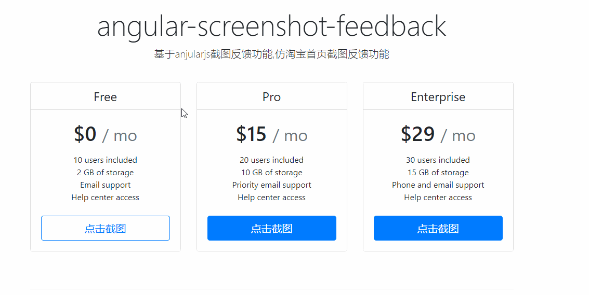

## angular-screenshot-feedback

基于anjularjs和html2canvas截图反馈功能。



### 安装源代码

>git clone https://github.com/zhangangs/angular-screenshot-feedback.git
>cd angular-screenshot-feedback
>npm install
>bower install
>gulp serve

### 引入css和js：
```
<script src="/src/angular-screenshot-feedback.js"></script>
<script src="/src/html2canvas.min.js"></script>
```
```
<link rel="stylesheet" href="/src/css/angular-sceenshot-feedback.css">
```

### 参数
img-url： 截图的url链接（base64格式）

### 示例

js:
``` js
/**
 * index page
*/
var app = angular.module('app', ['screenshotFeedBack']).controller('appCtrl', appCtrl);

appCtrl.$inject = ['$scope'];

function appCtrl($scope) {
    $scope.imgUrl = '111';
    
}
```

html:
``` html
<button type="button" class="btn btn-lg btn-block btn-outline-primary" feedback img-url="imgUrl">点击截图</button>
```